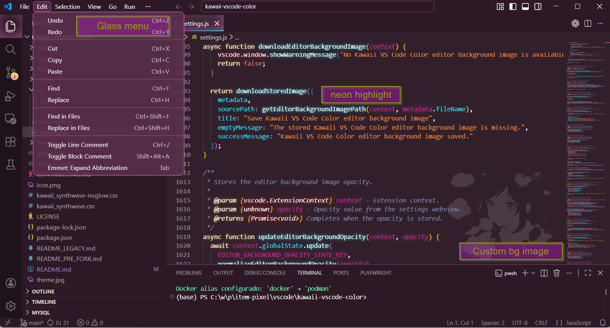
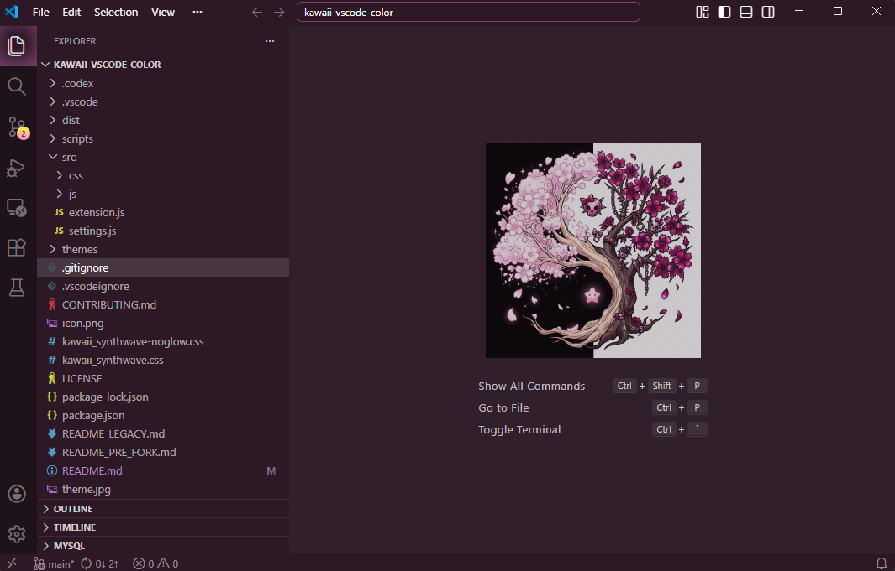
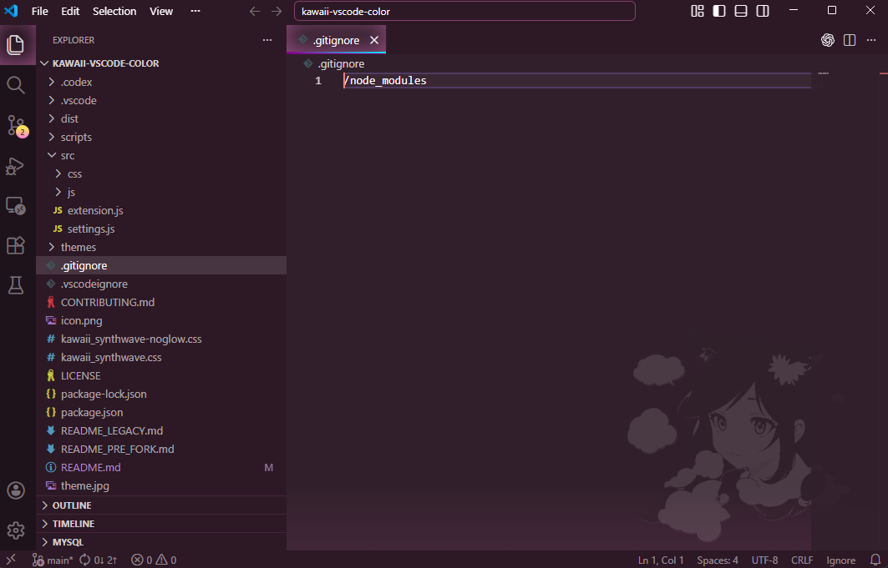
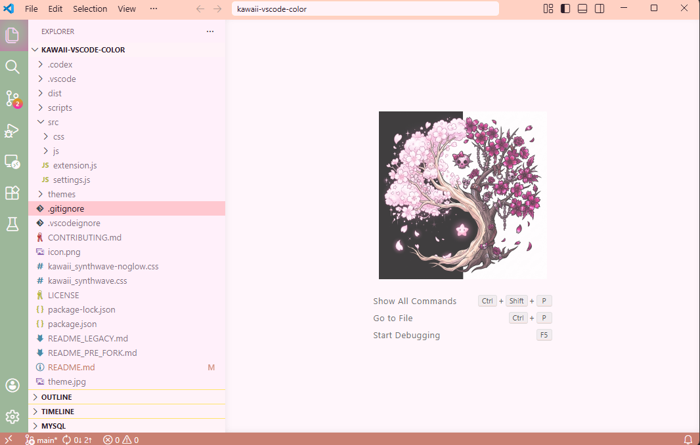
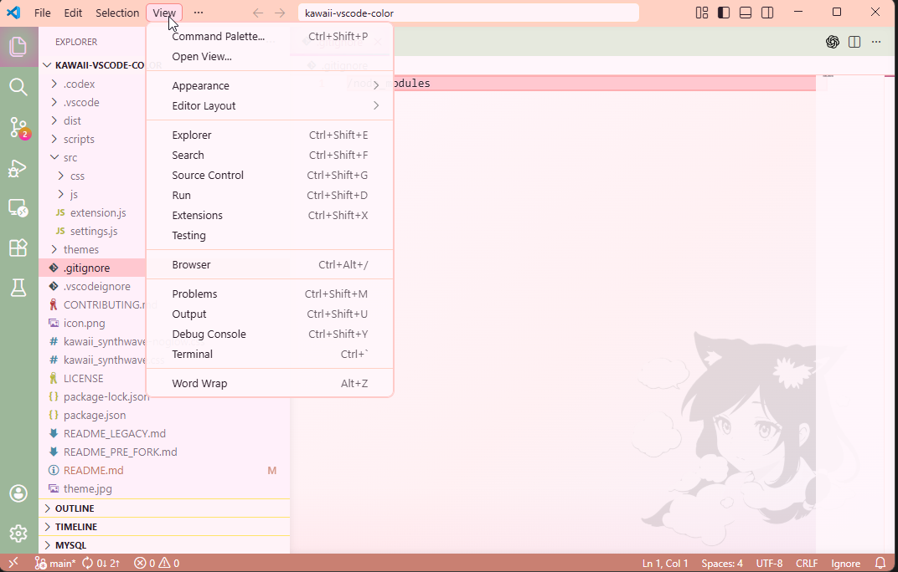
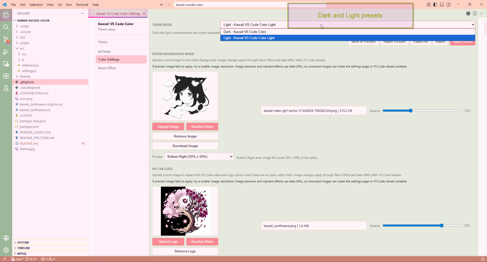
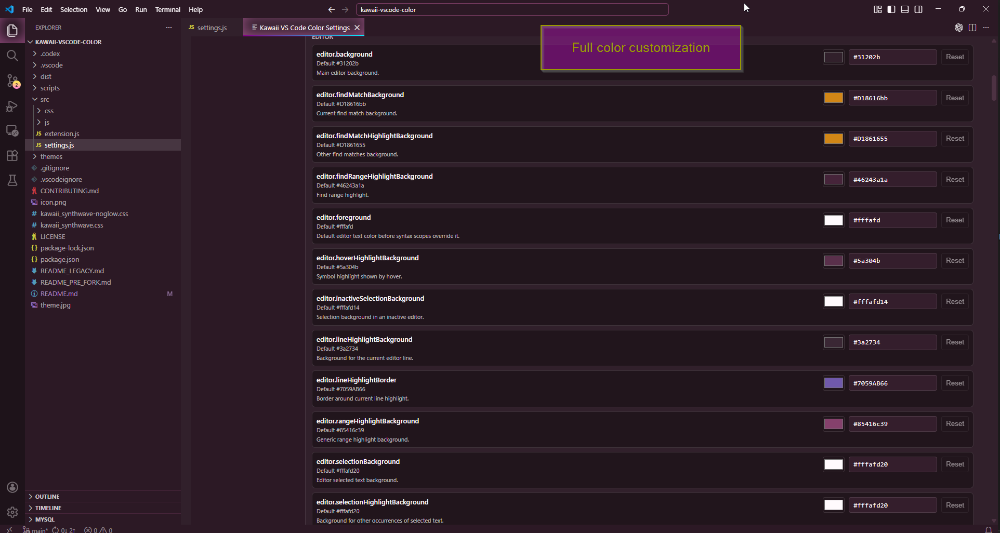
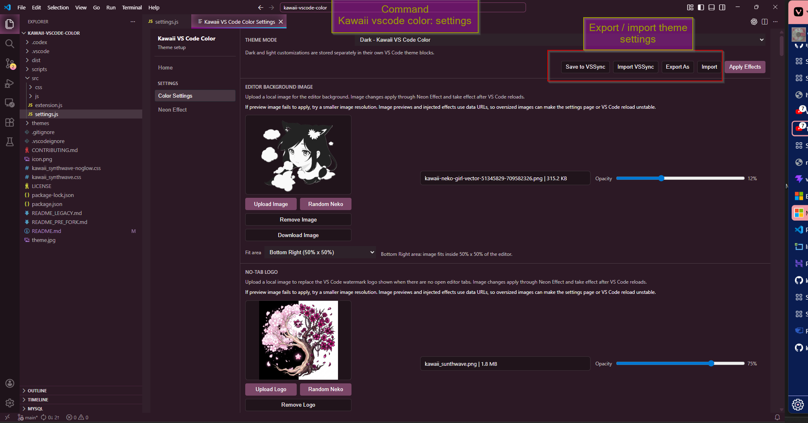

# Kawaii VS Code Color


Kawaii VS Code Color is a TypeScript-based VS Code theme extension with dark pink and light green pastel-pink themes, VS Code application settings, optional modular Effects workbench styling, image-backed editor customization, Settings Sync support, and JSON import/export.

The current extension has grown into a standalone codebase with a compiled TypeScript extension host, typed settings/effects services, a settings webview, generated theme assets, local VSIX packaging, and automated unit, DOM, integration, package, and E2E validation.

## Current Project

| Area | Current behavior |
| --- | --- |
| Themes | Ships `Dark Pink Kawaii` and `Light Pink-Pastel Kawaii`, generated from protected base themes plus Kawaii override files. |
| Settings UI | Opens `Kawaii VS Code Color: Settings` as an editor tab for VS Code application preferences, color overrides, Effects controls, image customization, Settings Sync, JSON export/import, and help links. |
| Customization | Writes user-specific VS Code settings instead of mutating packaged theme files at runtime. |
| Effects | Optionally patches VS Code workbench files to add modular runtime, editor background images, no-tab logo replacement, and glow effects. |
| Development | Uses strict TypeScript source, stable JavaScript wrappers for scripts, and project-owned validation commands. |

## Release Notes

User-facing and maintainer release notes are tracked in [CHANGELOG.md](./CHANGELOG.md). The current release work focuses on bounded renderer observers, repeated Effects apply safety, generated workbench asset cleanup, copied image assets instead of injected image payloads, modular patch switches, public theme color packs, VS Code application settings defaults, and Settings Sync / JSON bundle coverage.

## Preview

















## User Guide

### Installation

Install from the Visual Studio Marketplace:

- Marketplace page: [Kawaii VS Code Color](https://marketplace.visualstudio.com/items?itemName=ITEM-PIXEL.kawaii-vscode-color)
- Extension Name: `Kawaii VS Code Color`

Install from VS Code:

1. Open the Extensions view.
2. Search for `Kawaii VS Code Color`.
3. Select `Install`.

Install from the command line:

```powershell
code --install-extension ITEM-PIXEL.kawaii-vscode-color
```

If you received a `.vsix` file:

1. Open the Extensions view.
2. Select `Views and More Actions...`.
3. Select `Install from VSIX...`.
4. Choose the `.vsix` file.

### Setup

Enable the theme:

1. Open the Command Palette.
2. Run `Preferences: Color Theme`.
3. Select `Dark Pink Kawaii` or `Light Pink-Pastel Kawaii`.

Open the extension settings:

1. Open the Command Palette.
2. Run `Kawaii VS Code Color: Settings`.
3. Use the side menu to switch between `Home`, `Settings`, `Color Settings`, `Effects`, `Image Customization`, `Sync/Files`, and `Help`.

The settings window opens as a normal editor tab.

### Settings Window

| Area | Purpose |
| --- | --- |
| `Home` | Shows project links and extension information. |
| `Settings` | Controls VS Code startup, tab, folder-window, and session restore preferences from the extension UI. |
| `Color Settings` | Changes theme mode and workbench or syntax color overrides. |
| `Effects` | Enables, disables, and selects the unsupported VS Code workbench patch modules used for runtime, editor background, no-tab logo, and glow effects. |
| `Image Customization` | Stores editor background and no-tab logo image inputs, opacity/fit controls, and the `Apply Effects` action used by the Effects patch. |
| `Sync/Files` | Saves or restores settings through VS Code Settings Sync, JSON export, and JSON import. |
| `Help` | Shows repository, issue tracker, README/homepage, and publisher/contact links from project metadata. |

The settings webview must use the active editor theme for its own UI. Its CSS consumes VS Code webview tokens such as `--vscode-editor-background`, `--vscode-foreground`, `--vscode-button-background`, and `--vscode-panel-border`; it must not define a separate hardcoded product palette for page surfaces, text, controls, panels, or states.

### Application Settings

On first activation in a VS Code profile, the extension applies these user-scope VS Code application defaults:

- Open the native VS Code Welcome page on startup.
- Show editor tabs as multiple tabs.
- Wrap editor tabs instead of scrolling.
- Open new project or folder selections in another window.

The first activation setup preserves the user's existing `window.restoreWindows` value. Its local marker is not registered for VS Code Settings Sync, so another synced machine/profile can run its own first-profile setup.

The `Settings` page reads the current VS Code values every time the settings UI opens. Saving from that page writes explicit user-scope VS Code settings for startup editor behavior, editor tab display, tab wrapping, new-folder window behavior, and session restore behavior.

### Color Settings

The `Color Settings` page edits local user overrides for the selected theme mode.

- Dark edits are written to `[Dark Pink Kawaii]`.
- Light edits are written to `[Light Pink-Pastel Kawaii]`.
- Existing settings under `[Kawaii VS Code Color]` and `[Kawaii VS Code Color Light]` are read as legacy aliases and migrated on the next write.
- Workbench colors are stored in `workbench.colorCustomizations`.
- Syntax colors are stored in `editor.tokenColorCustomizations`.
- Packaged theme source files are not modified.

Use `Reset` to remove one custom color. Use `Reset All` to remove all color customizations for the selected theme mode.

### Image Customization

The `Image Customization` page can store one editor background image and one no-tab logo replacement.

| Setting | Behavior |
| --- | --- |
| `Upload Image` | Selects a local editor background image. |
| `Upload Logo` | Selects a local no-tab logo image. |
| `Random Neko` | Fetches a non-NSFW random image and uses it as the selected image input. |
| `Download Image` / `Download Logo` | Saves the current stored image with a Save As dialog. |
| `Remove Image` / `Remove Logo` | Removes the stored image input. |
| `Opacity` | Controls the injected image layer opacity. |
| `Fit Area` | Fits the editor background image inside full, half, or corner regions. |
| `Apply Effects` | Applies the selected Effects module stack using the current image settings. |

Supported image formats:

- PNG
- JPG/JPEG
- WEBP
- SVG

Images are capped at 2 MB. Settings previews use `data:` URLs and JSON exports carry base64 image payloads. Effects copy selected images into generated workbench asset files when effects are applied, but oversized images can still slow reloads; use a smaller image resolution if VS Code feels unstable.

Image changes do not auto-apply. Click `Apply Effects`, then reload VS Code when prompted. If the editor does not refresh cleanly, close and open VS Code manually.

### Sync, Export, and Import

| Button | Behavior |
| --- | --- |
| `Save to VSSync` | Saves the current Kawaii VS Code Color settings bundle into VS Code synced extension global state. |
| `Import VSSync` | Restores the synced Kawaii VS Code Color settings bundle on another synced installation. |
| `Export As` | Saves the current settings bundle as a JSON file with a Save As dialog. |
| `Import` | Opens a JSON file picker and applies a previously exported settings bundle. |

The settings bundle includes:

- VS Code application settings controlled by the `Settings` page.
- Active theme mode.
- Dark and light workbench color overrides.
- Dark and light token color overrides.
- Glow brightness and glow disable setting.
- Editor background image metadata, image bytes, opacity, and fit area.
- No-tab logo image metadata, image bytes, and opacity.

VS Code Settings Sync must be enabled in VS Code for `Save to VSSync` / `Import VSSync` to move data between machines.

### Effects

VS Code color themes do not natively support text glow, editor background images, no-tab logo replacement, or arbitrary editor CSS. Those effects are provided by the optional Kawaii Neon runtime path.

Effects modify VS Code workbench files by adding one marked `kawaii-vscode-colors-ui.js` script reference with a refresh key. They write generated CSS and copied image assets next to the workbench HTML. That script adds the `.kawaii-vscode-colors-ui` class plus selected module classes to the highest workbench root, links the generated `kawaii-vscode-colors-ui.min.css` stylesheet, and emits scoped token glow rules when Glow Effects are enabled. The original VS Code token/style tags are not edited in place; the effect is additive and wrapper-conditioned.

The Effects stack has four independently selectable modules:

- `Foundation / Runtime Layer`: installs or removes the runtime wrapper script and shared stylesheet.
- `Editor Background`: applies the editor gradient, background image, opacity, and fit area.
- `No-Page Logo`: replaces the empty editor watermark logo when no tab is open.
- `Glow Effects`: applies syntax glow, active tab glow, activity indicators, and lightbulb styling.

Clicking `Apply Effects` cleans previous generated modifications and assets, then applies the selected module stack. All modules default to enabled.

Use it with caution:

- Administrator permissions may be required on Windows.
- VS Code may show an unsupported or corrupted installation warning.
- VS Code updates can overwrite the patch.
- Disable the effect before troubleshooting editor startup or workbench rendering issues; disabling removes the marked HTML reference and generated Kawaii JS/CSS/image assets.

Enable or disable the effect:

1. Run `Kawaii VS Code Color: Settings`.
2. Open `Effects`.
3. Use `Enable Effects` or `Disable Effects`.
4. Reload VS Code when prompted.

If VS Code shows the corruption warning, the `Effects` page includes the official VS Code FAQ link and an optional checksum-fix community workaround. The supported recovery path is to disable Effects and reinstall or repair VS Code so the modified workbench files are replaced.

### VS Code Settings

Customize glow brightness:

```json
{
  "kawaii_synthwave.brightness": 0.45
}
```

The value should be a number from `0` to `1`. The default is `0.45`.

Keep editor chrome updates but disable token glow:

```json
{
  "kawaii_synthwave.disableGlow": true
}
```

After changing either setting, open `Kawaii VS Code Color: Settings`, apply Effects again, and reload VS Code.

## Developer Guide

### TypeScript Architecture

The extension runtime is compiled from TypeScript into `out/src`, and `package.json.main` points to `./out/src/extension.js`.

| Area | Source of truth |
| --- | --- |
| Extension activation | `src/extension.ts` registers commands, applies first-profile application settings defaults, configures Settings Sync keys, handles theme changes, and composes services. |
| Extension host services | `src/extensionHost` contains typed controllers, adapters, and services for Settings and Effects workflows. |
| Settings webview | `src/settings.ts`, `src/settingsWebview.ts`, and `src/webview/settings` own the settings editor tab, view model contracts, messages, and VS Code webview token styling. |
| Shared contracts | `src/shared` contains typed models, message contracts, renderer placeholders, schemas, guards, and validation helpers. |
| Injected renderer | `src/js/theme_template.js` remains the workbench runtime template; `src/renderer/ThemeTemplate.ts` mirrors renderer contracts for TypeScript tests. |
| Theme generation | `themes/*.json` color packs are edited by hand or updated from the public GitHub folder; `src/core-themes` stores protected bases; `scripts/build-color-theme.ts` generates `src/generated-themes` outputs loaded by VS Code. |
| Workbench CSS | `src/scss/kawaii-vscode-colors-ui.scss` and `scripts/build-ui-css.ts` generate the scoped CSS linked by the injected runtime. |
| Build scripts | `scripts/*.ts` hold implementations; matching `scripts/*.js` files stay as stable command wrappers. |

### Local Setup

Install project dependencies:

```powershell
npm install
```

Validate the extension metadata and scripts:

```powershell
npm pkg get name version publisher dependencies devDependencies engines
npm run test:check
npm run test:unit
npm run test:dom
npm run test:integration
npm run test:package
npm run test:e2e
npm run test:all
npm run update:themes -- --dry-run
npm run build:theme
```

### Automated Tests

The project has four regular automated test layers, plus one gated Effects E2E layer:

| Command | Layer | Purpose |
| --- | --- | --- |
| `npm run test:check` | Static project check | Runs TypeScript no-emit checks, the Codex docs drift guard, compile checks, and `node --check` against runtime and build JavaScript files. |
| `npm run test:unit` | Unit tests without UI | Uses Node's built-in test runner for build logic, workbench patch helpers, settings persistence modules, first-profile application settings, chained Settings Sync / JSON import-export state matrices, and mocked settings message chains. |
| `npm run test:dom` | DOM UI tests | Uses `jsdom` to load the settings webview HTML and verify safe `postMessage` events, app navigation, Help metadata, Color Settings inputs/debounce, Image Customization image/logo state, incoming webview messages, warnings/errors, and `--vscode-*` token usage. |
| `npm run test:integration` | VS Code integration | Uses `@vscode/test-cli` and `@vscode/test-electron` to activate the extension in an Extension Development Host and execute the settings command. |
| `npm run test:package` | Local package check | Compiles script wrappers and runs the TypeScript-backed local VSIX package helper without bumping the package version. |
| `npm run test:cleanup-diagnostics` | Cleanup diagnostics | Compiles script wrappers and reports stale disposable VS Code processes and known test artifact roots. |
| `npm run test:cleanup-processes` | Cleanup diagnostics kill mode | Runs the same diagnostic path and terminates only matching disposable VS Code processes. |
| `npm run test:e2e` | Real VS Code UI E2E | Uses ExTester/WebDriver to package the extension, open a disposable VS Code, run `Kawaii VS Code Color: Settings`, navigate the real webview, validate safe UI flows, and write the project-owned last-run marker. |
| `npm run test:e2e:current` | Experimental real VS Code UI E2E | Runs the same safe E2E suite in separate `.vscode-test/extest-current` storage using ExTester's `max` VS Code version by default; override with `KAWAII_E2E_CURRENT_CODE_VERSION=<version>` when probing a specific stable VS Code build. |
| `npm test` | Full suite | Runs unit, DOM, and VS Code integration tests in sequence. |
| `npm run test:all` | Safe local gate | Runs static checks, unit, DOM, integration, local package, and safe E2E layers in order, then prints a final pass/fail/skipped summary. It intentionally excludes the gated Neon patch flow. |

Safety matrix:

| Command | Safe by default | Applies real patch | Use |
| --- | --- | --- | --- |
| `npm run test:unit` | Yes | No | Logic, settings persistence, bundles, effects, fixtures, and mocked message chains. |
| `npm run test:dom` | Yes | No | Isolated settings webview DOM and `--vscode-*` token contract. |
| `npm run test:integration` | Yes | No | Extension Host activation and command smoke tests. |
| `npm run test:package` | Yes | No | Local package helper, VSIX contents, and prepublish compile/theme build path without a version bump. |
| `npm run test:e2e` | Yes | No | Real disposable VS Code UI without destructive actions. |
| `npm run test:e2e:current` | Yes | No | Experimental compatibility probe for the safe E2E suite in separate storage. |
| `npm test` | Yes | No | Unit, DOM, and integration layers. |
| `npm run test:all` | Yes | No | Static, unit, DOM, integration, package, and safe E2E local gate. |
| `npm run test:e2e:neon` | No, requires flag | Yes, only under `.vscode-test/extest-111-neon` | Real `Apply Effects`, all 16 Effects switch combinations, Kawaii Neon patch, injected CSS, restart, image switch/revert, disable, and restore lifecycle. |

The integration suite opens `Kawaii VS Code Color: Settings`, but it does not control the rendered VS Code window. The safe E2E suite does control the real window and webview, but it is still safe by default: it does not click `Enable Effects`, `Disable Effects`, or `Apply Effects`. Upload/import/export/download and Random Neko flows are covered only through explicit E2E fixture hooks, so no native OS dialog or external network request is used. E2E screenshots and state notes are written under `test-results/e2e`.

`test-results/e2e/kawaii-last-run.json` is the project-owned source of truth for the last `npm run test:e2e`, `npm run test:e2e:current`, or gated `npm run test:e2e:neon` execution. It records the mode, status, timings, exit code, disposable storage paths, Mocha phase configs, failed test ids when the current run fails, and key artifact paths. `test-results/e2e/.last-run.json` is an ExTester diagnostic file only and can be stale after later successful runs.

The safe E2E suite also writes `settings-visual-*.png` screenshots plus `settings-visual-state-analysis.json`. Those artifacts cover the Settings webview image previews, selected-image warnings, missing-image states, Random Neko loading presentation, effects warning, Effects status, error status, invalid color input, empty color filter, opacity value changes, editor background fit selector state, controlled fixture dialog flows, and color picker alpha persistence. The JSON file records programmatic PNG difference, color-ratio, or contrast metrics for each before/after visual assertion.

Visual test rule: tests should create screenshots only for behavior that changes a visible UI or theme state. When a visual state changes, keep before/after evidence, or a baseline/after pair, so the rendered result can be inspected alongside DOM/CSS assertions.

The real Effects patch has its own gated command:

```powershell
$env:KAWAII_E2E_ALLOW_NEON_PATCH = "1"
npm run test:e2e:neon
```

`npm run test:e2e:neon` patches only the disposable VS Code installation under `.vscode-test/extest-111-neon`. The runner refuses Kawaii Neon mode unless `KAWAII_E2E_ALLOW_NEON_PATCH=1` is present and the storage path resolves inside that disposable directory. It runs five separate VS Code launches to validate the same lifecycle users may need manually: before applying, after applying dstgroup images and reopening VS Code, after switching to an alternate image and reopening VS Code, after reverting to dstgroup and reopening VS Code, and after removing the patch and reopening VS Code. During the first launch it applies every Foundation / Runtime Layer, Editor Background, No-Page Logo, and Glow Effects switch combination, reloads the disposable workbench, captures before/after screenshots, validates generated HTML/JS/CSS/assets, validates runtime module classes, and writes `test-results/e2e/neon-effects-combination-matrix.json`. It verifies the workbench HTML hash returns to the original baseline and that injected runtime CSS uses editor-provided `--vscode-*` tokens rather than a standalone UI palette.

The gated Kawaii Neon suite imports controlled settings fixtures through internal test hooks exposed only when `KAWAII_E2E_ALLOW_NEON_PATCH=1`. Its first apply path validates every modular Effects combination through the real Settings webview before leaving the default all-on stack applied for the restart phases. It validates generated `kawaii-vscode-colors-ui.js`, enabled module class literals, generated CSS asset URLs, editor background opacity/fit, no-tab logo opacity, active no-page fallback selector, runtime style tags, screenshots, image replacement, dstgroup logo restoration, generated asset deletion after disable, and final HTML restoration. It also writes a visual editor-background fit matrix under `test-results/e2e` with a no-overlay baseline plus one screenshot for each supported fit area: `full`, `top`, `bottom`, `left`, `right`, `top-left`, `top-right`, `bottom-left`, and `bottom-right`.

### Build a Local VSIX

Package the extension:

```powershell
npm run build:local
```

Validate the package helper without changing `package.json.version`:

```powershell
npm run test:package
```

Install the generated VSIX in VS Code:

```powershell
code --install-extension .\dist\kawaii-vscode-color-<version>.vsix --force
```

For VS Code Insiders:

```powershell
code-insiders --install-extension .\dist\kawaii-vscode-color-<version>.vsix --force
```

### Theme Color Workflow

- Keep `src/core-themes/kawaii_synthwave-color-theme.json` as the protected dark base theme.
- Keep `src/core-themes/kawaii_synthwave-color-theme-light.json` as the protected light base theme.
- Put dark palette changes in `themes/dark-pink-kawaii.json`.
- Put light palette changes in `themes/light-pink-pastel-kawaii.json`.
- Keep every public color pack in `themes/` as `theme-id.json` with non-null numeric `version.major`, `version.minor`, and `version.patch`.
- Run `npm run update:themes -- --dry-run` to validate the public GitHub `themes` folder without writing local files.
- Run `npm run update:themes` to download only missing packs or packs with a higher remote `version`.
- Run `npm run build:theme` to regenerate the native theme JSON files and internal catalog under `src/generated-themes`.
- VS Code loads generated themes through `package.json.contributes.themes`.

### Manual Theme Test

1. Open this repository in VS Code.
2. Run `npm run build:theme`.
3. Press `F5` to launch the Extension Development Host.
4. Select `Dark Pink Kawaii` or `Light Pink-Pastel Kawaii`.
5. Inspect representative files and use `Developer: Inspect Editor Tokens and Scopes` for token rules.

Live Effects testing is possible from the Extension Development Host, but it patches the VS Code installation used by that host. Prefer a disposable VS Code installation or VS Code Insiders.

### Publishing

Before publishing:

- Confirm `package.json.publisher` is `ITEM-PIXEL`.
- Confirm `package.json.name` is `kawaii-vscode-color`.
- Confirm `package.json.repository.url` points to the public repository that contains the README images.
- Confirm [CHANGELOG.md](./CHANGELOG.md) has a release section for the package version being published.
- Package to `./dist` with `npm run build:local`.
- Publish only from an account authorized for the configured publisher.

## History

Kawaii VS Code Color is rewrited with Typescript and roots in `SynthWave '84 - VS Code theme`, It also extends with its own settings UI, persistence, generated assets, packaging flow, and test coverage. Historical README material and attribution details are preserved in [README_LEGACY.md](./README_LEGACY.md).

## References

- Marketplace extension: [Kawaii VS Code Color](https://marketplace.visualstudio.com/items?itemName=ITEM-PIXEL.kawaii-vscode-color)
- Repository: [EmmiiChan/kawaii-vscode-color](https://github.com/EmmiiChan/kawaii-vscode-color)
- Changelog: [CHANGELOG.md](./CHANGELOG.md)
- VS Code Color Theme guide: [Color Theme](https://code.visualstudio.com/api/extension-guides/color-theme)
- VS Code Theme Color reference: [Theme Color](https://code.visualstudio.com/api/references/theme-color)
- VS Code theme customization: [Customize a color theme](https://code.visualstudio.com/docs/configure/themes#_customize-a-color-theme)
- VS Code Settings Sync extension state: [Common Capabilities - Data Storage](https://code.visualstudio.com/api/extension-capabilities/common-capabilities)
- VS Code extension manifest reference: [Extension Manifest](https://code.visualstudio.com/api/references/extension-manifest)
- VS Code publishing guide: [Publishing Extensions](https://code.visualstudio.com/api/working-with-extensions/publishing-extension)
